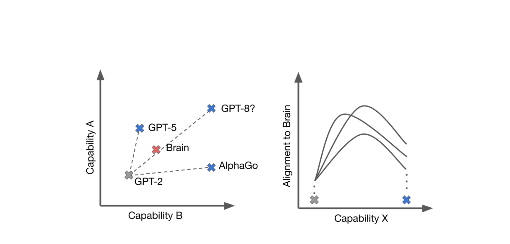

# Beneficial Misalignment: Why We Shouldn't Always Align AI to Humans
Date: Mar 17, 2026
By Brian Cheung

In the rapidly evolving field of NeuroAI, a significant amount of energy is dedicated to 'alignment', the idea that representations from artificial intelligence should converge towards biological intelligence (Yamins et al. (2014)). The prevailing measuring stick for progress is often how closely an artificial neural network mimics the biological brain. The logic is compelling: the brain is our only proof of concept for general intelligence, so the closer our machines get to biological representations, the closer they must be to true intelligence.

But this convergence relies on an assumption we rarely question: that the human brain is the ceiling of intelligence.

I would argue the opposite.

As artificial intelligence begins to surpass human performance, we should not expect, nor necessarily desire, this alignment to continue. In fact, we are entering an era where **"Beneficial Misalignment"** may be the key to super-human capability.

## The Divergence Point

For years, the goal has been convergence. We celebrate when a vision model's activation patterns match those of a primate visual cortex. But we must consider the 'Space of Capabilities', the multi-dimensional space of abilities where human intelligence occupies a singular point or, at best, a small contiguous region.

When an AI is performing at a sub-human or human level, alignment is a useful proxy for competence. If a robot walks like a human, it's probably walking well. But as we push into super-human territory, the constraints of biology become just that: constraints. If we force a system to process information exactly like a human, we implicitly cap its potential at the human level.

True super-intelligence might require representations that look nothing like ours.

## The Lesson of Move 37

The most compelling argument for beneficial misalignment isn't theoretical; it happened in 2016 during DeepMind's AlphaGo match against Lee Sedol.

In Game 2, AlphaGo (Silver et al. (2017)) played **Move 37**, a move that stunned commentators and professionals alike. It was described as "creative," "bizarre," and distinctly *alien*. A human player would never have played it.

- **Human Alignment:** Playing the move a human master would expect.
- **Beneficial Misalignment:** Calculating a move with a 1-in-10,000 probability of being played by a human, which ultimately secured the win.

It was precisely its divergence, its misalignment with human expectation, that allowed it to find a solution outside our cognitive horizon.

## Shifting from Features to Goals

As we look toward the next generation of AI, we need to rethink our metrics. The question should not be, "Does this model think like us?" but rather, "Does this model achieve the goals we care about?" Our evaluations should focus on the goals we hope human intelligence to accomplish (e.g. inventions, cures, discoveries).

If an AI can perceive high-dimensional physics that our brains evolved to ignore, or solve complex biological folding problems using "alien" logic, we should embrace that difference. The future shouldn't just be about **aligning features** (mechanistic similarity), but about **aligning outcomes**.

## Conclusion

To be clear, if the goal is to understand the brain itself, then biological alignment is entirely appropriate, perhaps even necessary. A model that mirrors cortical representations can be scientifically valuable even if it is not the most capable possible system. But that is a different objective from building AI that exceeds human performance. We should not let the goals of explanation and the goals of capability constrain one another.

Brain-like models may help us understand ourselves; they should not automatically define the limits of what our machines are allowed to become. Intelligence needs to be redefined another time. It was redefined to learn from data generated by humans. It now needs to learn from environments which create the outcomes we want.

As we cross the threshold into super-human performance, we must be willing to let go of the human brain as the gold standard for all representations.

Sometimes, the best way for an AI to help us is to think in ways we never could.

---

## References

- **Silver, D., Schrittwieser, J., Simonyan, K., Antonoglou, I., Huang, A., Guez, A., Hubert, T., Baker, L., Lai, M., Bolton, A., Chen, Y., Lillicrap, T., Hui, F., Sifre, L., van den Driessche, G., Graepel, T., & Hassabis, D. (2017).** Mastering the game of Go without human knowledge. *Nature*, 550(7676), 354–359.

- **Yamins, D. L. K., Hong, H., Cadieu, C. F., Solomon, E. A., Seibert, D., & DiCarlo, J. J. (2014).** Performance-optimized hierarchical models predict neural responses in higher visual cortex. *Proceedings of the National Academy of Sciences*, 111(23), 8619–8624.